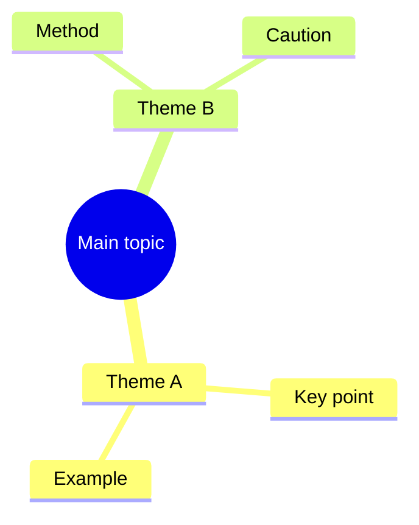

# Video Transcript Mindmap Skill

Use this skill when the user gives you a video link and wants more than just a download:

- a complete written transcript
- a mind map or structured outline
- bilingual transcript deliverables
- a cleaner study package for a talk, lesson, lecture, interview, tutorial, or multi-video series
- optional Markdown, Word, PowerPoint, PDF, or zip outputs derived from the final transcript

This skill reuses the sibling `video-downloader` skill instead of reinventing the download and transcription steps.

## What to deliver

Unless the user asks for a different format, produce this deliverable set:

- `01_metadata.md` - title, source URL, detected language, duration if known, and file inventory
- `02_transcript_original.md` - complete transcript in the source language
- `03_transcript_zh.md` - complete Chinese transcript if the source language is not Chinese
- `04_mindmap.md` - hierarchical Markdown mind map
- `05_mindmap.mmd` - Mermaid `mindmap` or `flowchart TD` version when useful

If the source language is already Chinese, do not create a redundant translated transcript unless the user explicitly asks for one.

If the user asks for a report package, also produce the requested formats from the same corrected transcript source:

- `06_report.md` - structured Markdown report or study guide
- `07_report.docx` - Word output when requested
- `08_report.pptx` - PowerPoint output when requested
- `09_report.pdf` - PDF output when requested or when a practical fallback exists
- `deliverables/` - final user-facing copies with stable filenames
- `deliverables/<topic>_package.zip` - verified archive when the user wants a bundle

If the user explicitly asks for a professional analysis report, expand the package beyond bullets and summaries:

- explain why the framework matters
- explain each major logic in plain language
- connect the layers into one cause-and-effect chain
- state the intended user, likely misunderstandings, and the framework's limits

## Workflow

### 1. Create a clean working folder

Make a task folder before doing any download or transcription work. Prefer a folder name based on the video title or platform ID.

Keep raw assets and final deliverables separate:

- `raw/` for downloaded video, subtitles, metadata, thumbnails
- `docs/` for transcript and mind map outputs
- `deliverables/` for final exports that the user is expected to open directly

If the user asks for a series, course, or playlist, keep both per-video and merged outputs:

- `docs/per_video/<episode_id>_<short_title>/` for episode-level transcript artifacts
- top-level `docs/` for the merged transcript, merged mind map, and merged report
- preserve stable episode numbering so later cleanup can point back to the source episode quickly

### 2. Download first, transcribe second

Prefer existing subtitles over speech-to-text when they are available and good enough.

From this skill folder, the sibling downloader tools are here:

- `../video-downloader/scripts/smart_download.ps1`
- `../video-downloader/scripts/transcribe.py`

Recommended sequence:

1. Run the downloader against the user URL.
2. Check whether subtitle files were downloaded.
3. Prefer subtitle sources in this order:
   - human-authored subtitles
   - platform auto subtitles
   - Whisper transcript generated from audio
4. Only fall back to transcription when subtitle coverage is missing, poor, or obviously incomplete.

Example commands:

```powershell
../video-downloader/scripts/smart_download.ps1 -Url "https://example.com/video"
python ../video-downloader/scripts/transcribe.py ".\raw\video.mp4" --model medium --language auto --output ".\docs\02_transcript_original.md"
```

### 3. Correct the transcript before building derivatives

Treat one corrected transcript as the single source of truth.

Preferred correction loop:

1. compare subtitles, auto captions, and ASR output when more than one source exists
2. fix obvious names, terms, numbers, and sentence breaks when the meaning is clear
3. if a passage is still uncertain, mark it explicitly with a timestamp instead of guessing
4. keep a short review note file when manual cleanup matters, for example `notes/cleanup_notes.md`
5. keep a quality-risk file when unresolved phrases remain, for example `notes/quality_flags.md`
6. if needed, extract short review clips around uncertain spans so the next pass can focus on exact timestamps

If the source is long, technical, or terminology-heavy, do not stop at the first acceptable draft if obvious transcript errors still remain.

### 4. Build the mind map from the final transcript

Always build the mind map from the transcript that will be handed to the user, not from memory or guesswork.

Prefer these steps:

1. identify the main topic or thesis
2. split the content into major sections or arguments
3. add key supporting points under each section
4. add examples, methods, cautions, or takeaways as child nodes when they matter

### 5. Regenerate downstream outputs after every transcript correction

If you change the transcript after spotting an error, rebuild every downstream deliverable that depends on it.

That usually means:

- regenerate the Markdown report from the corrected transcript
- regenerate `.docx`, `.pptx`, and `.pdf` outputs from the corrected report or corrected transcript
- refresh the final `deliverables/` copies instead of leaving older files beside newer text
- sweep text-bearing deliverables for stale placeholders such as unresolved `[inaudible ...]` markers that should no longer be present

Never let the report package drift away from the final corrected transcript.

If an output file is locked by another process, write an `_updated` variant beside it and tell the user which file could not be overwritten.

### 6. Expand into a professional analysis report when asked

When the user wants a `simple but detailed professional analysis report`, turn the transcript and mind map into a readable long-form explanation rather than stopping at a study outline.

Preferred structure:

1. report positioning and one-line thesis
2. why the framework matters
3. layer-by-layer explanation of the main logic
4. how the layers connect into a single decision chain
5. who the framework suits, where it can be misapplied, and its limits
6. quick-start usage steps for ordinary readers

If the package now includes multiple heavy outputs such as `.docx`, `.pptx`, `.pdf`, and zip, create a small project-scoped generator under the task folder's `scripts/` directory so the package can be rebuilt reproducibly.

### 7. Package and verify the final bundle

When the user wants a final package:

1. gather the exact deliverables the user asked for under `deliverables/`
2. write the zip archive to a temporary path first
3. verify the archive with Python `zipfile.ZipFile` before replacing any previous bundle
4. only then move or replace the final zip path
5. confirm that the archive contains the expected files and can be opened cleanly

If desktop office export tools are missing, use the best available local fallback and state the limitation clearly:

- `python-docx` for Word generation
- `python-pptx` for PowerPoint generation
- a library-based or image-based PDF fallback when full Office or LibreOffice export is unavailable

## Transcript rules

The transcript is a document, not a summary.

- Keep it complete and faithful to the speaker.
- Do not compress multiple paragraphs into one.
- Preserve specialized terminology, names, product names, and quoted phrases.
- If audio is unclear, mark it explicitly like `[inaudible 12:31]` instead of guessing.
- If subtitles contain obvious OCR or ASR mistakes, correct only when the meaning is clear.
- If the video has sections, add section headings to improve readability, but do not remove content.

If the source language is not Chinese:

- keep `02_transcript_original.md` in the original language
- create `03_transcript_zh.md` as a full Chinese translation, not a summary
- preserve paragraph structure as much as practical so the two versions are easy to compare

If the source language is Chinese:

- `02_transcript_original.md` can also serve as the main final transcript
- skip `03_transcript_zh.md` unless the user explicitly asks for rewriting, polishing, or bilingual output

## Mind map rules

The mind map should help the user review the video fast.

- Build it from the actual transcript, not from guesses.
- Keep the top level to the main thesis or major sections.
- Use 2-4 levels of depth; too flat loses value, too deep becomes unreadable.
- Prefer verbs and concrete nouns over vague labels.
- Include examples, case studies, frameworks, or action items as child nodes when they are central.

`04_mindmap.md` should be clean Markdown bullets. Example shape:

```markdown
# Mind Map

- Main topic
  - Theme A
    - Key point
    - Example
  - Theme B
    - Method
    - Caution
```

If a Mermaid file is useful, create `05_mindmap.mmd` too:



## Windows text and shell hygiene

When working with Chinese transcript files on Windows:

- do not trust PowerShell console rendering alone
- treat UTF-8 file reads as the source of truth
- if text looks garbled in the console, re-check with Python or another UTF-8-aware reader before declaring the file corrupted
- if the local PowerShell profile causes noise or startup failures, prefer a no-profile shell invocation for deterministic scripted steps

Console mojibake is not the same as file corruption.

When exporting on Windows, verify the export path instead of assuming it works:

- test whether `soffice` is really present before using LibreOffice conversion
- test whether Office COM automation really works before assuming native export is possible
- if those routes are unavailable, fall back to `python-pptx` for decks and a readable library-based or image-based PDF path for Chinese output
- if a fallback export is used, state that limitation explicitly in the final handoff

## Response format

When handing results back to the user:

- briefly say what you processed
- list the generated files
- note whether the transcript came from subtitles or transcription
- state the detected language
- if translation was needed, say that both original and Chinese documents were produced
- mention whether a merged series package was produced or only per-video outputs
- mention any report formats that were generated
- mention any limitations like missing subtitle segments or low audio quality

## Delivery-note and bundle maintenance

When new deliverables are added late in the project, keep the final package synchronized:

- update the delivery note or file inventory after adding report outputs
- rebuild the final zip after output changes instead of leaving an older archive in place
- verify the archive contents and openability before finishing

## Failure handling

If the video cannot be fully downloaded or transcribed:

- still save whatever metadata, subtitles, or partial transcript you can recover
- explain exactly what blocked completion
- offer the user the best partial package instead of stopping empty-handed

If a full report bundle is not possible:

- still provide the corrected transcript and mind map
- note which formats were skipped and why
- leave the project in a state where a later pass can rebuild the missing formats from the corrected transcript

## Quality bar

Before you finish, check:

- Is the transcript complete rather than summarized?
- If the source is non-Chinese, did you provide both original and Chinese transcript files?
- Does the mind map reflect the real structure of the video?
- If report outputs were requested, were they rebuilt from the final corrected transcript?
- If a professional analysis report was requested, does it explain the logic rather than only listing headings?
- Did any stale placeholder survive in the final user-facing files?
- Does the delivery note match the current set of outputs?
- If a zip was produced, does it open cleanly and contain the expected deliverables?
- Are filenames and paths easy for the user to open?
